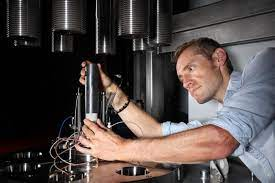

<!-- PROJECT LOGO -->
 

  

  <h3 align="center">FRANCOIS X. PASSELÈGUE</h3>

  

Science is not everything, but science is very beautiful.
     
    

      R.J. Hoppenheimer
           
     
     

   <a href="test.html">HOME</a> | <a href="publications.html">PUBLICATIONS</a> | <a href="cv.html">CV</a> | <a href="people.html">PEOPLE</a>

  

EXPERIMENTAL FRACTURE MECHANICS
     
CHARGÉ DE RECHERCHE CNRS
     
GÉOAZUR
     
UNIVERSITÉ DE CÔTE D'AZUR
     
E-mail: francois.passelegue@geoazur.unice.fr
     
ORCID: 0000-0002-4217-9817
